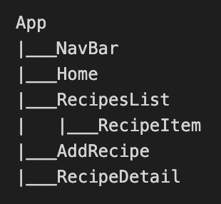

# Phase 2 Project: Recipe Journal

## Description

Recipe Journal is a single page React application created using create-react-app. We grab five random recipes from an API and render them into a list. Users can add, edit and delete recipes, including the name, image, serving size and step by step instructions. It builds on concepts such as components, props and state management while incorporating client-side routing and RESTful routing conventions.

## Components

Recipe Journal uses seven components. The hierarchy is shown below:

### NavBar and Home

The NavBar contains three NavLinks that point to Home, RecipesList and AddRecipe. The Home component is the initial page when starting the app. It provides simple directions on how to navigate through the site.

### RecipesList, RecipeItem and RecipeDetail

RecipesList renders a list of the recipes that includes the image, name and link to reveal details. Upon clicking on this link, users are directed to RecipeDetail where they can see the serving size and step by step instructions. If the recipe was from the API, there will be a link to go to the website where the recipe originated.

Users can edit a recipe by clicking on "Edit recipe." This will take them to a form that allows them to change any part of the recipe, from the image to the instructions. Finally, users can delete a recipe by clicking "Delete recipe."

### AddRecipe

Users can add a new recipe to the list by going to "Add Recipe" at the top of the page. Clicking the "Submit" button will programmatically navigate them back to the RecipesList page, with the newly added recipe at the bottom of the list.

## Support

Please contact me at jjpark987@gmail.com for any questions.

## Acknowledgment

The original database used for this project is Recipe - Food - Nutrition by David. Link is provided here:
https://rapidapi.com/spoonacular/api/recipe-food-nutrition/